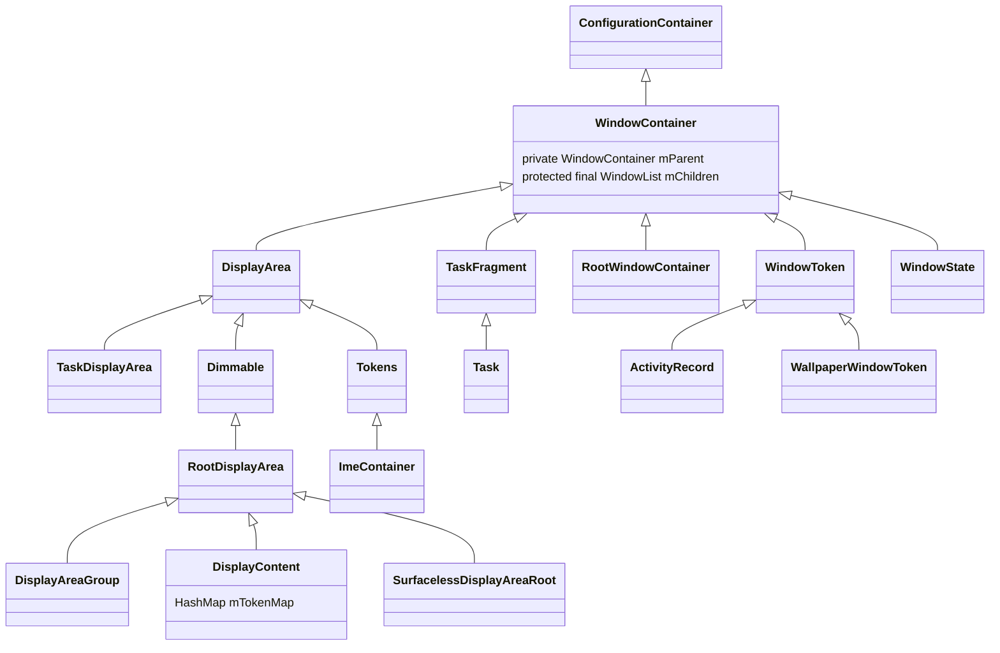

## 窗口的概念

在 Android 中，一个显示界面由多个窗口（Window）组成。       
从应用侧来看，我们可以通过 Activity 启动一个窗口，也可以通过 `WindowManager.addView` 方式创建一个窗口，它承载了一个应用界面的 View 层级结构。statusbar、navigationbar、Activity、Wallpaper 等都分别占据一个窗口，每个窗口都有一个Z轴的属性，高的窗口会盖在低的窗口之上，所以才会有statusbar 和 navigationbar覆盖在 Activity和Wallpaper之上，而 Activity 又会优先于 Wallpaper 显示。       

我们可以通过 `adb shell dumpsys window windows` 来查看当前系统的窗口的信息。       

```
WINDOW MANAGER WINDOWS (dumpsys window windows)
  Window #0 Window{41f2944 u0 ScreenDecorOverlayBottom}:
    ......
      mDrawState=HAS_DRAWN       mLastHidden=false
    ......
    isVisible=true
  Window #1 Window{433341c u0 ScreenDecorOverlay}:
    ......
      mDrawState=HAS_DRAWN       mLastHidden=false
    ......
    isVisible=true
  Window #2 Window{850839f u0 SecondaryHomeHandle0}:
    ......
      mDrawState=NO_SURFACE       mLastHidden=false
    ......
    isVisible=false
  Window #3 Window{c11d266 u0 EdgeBackGestureHandler0}:
    ......
      mDrawState=NO_SURFACE       mLastHidden=false
    ......
    isVisible=false
  Window #4 Window{e36811d u0 NavigationBar0}:
    ......
      mDrawState=HAS_DRAWN       mLastHidden=false
    ......
    isVisible=true
  Window #5 Window{c83f7e9 u0 sysui_occlude_anim}:
    ......
      mDrawState=NO_SURFACE       mLastHidden=false
    ......
    isVisible=false
  Window #6 Window{c110567 u0 NotificationShade}:
    ......
      mDrawState=NO_SURFACE       mLastHidden=false
    ......
    isVisible=false
  Window #7 Window{1ef3a5f u0 StatusBar}:
    ......
      mDrawState=HAS_DRAWN       mLastHidden=false
    ......
    isVisible=true
  Window #8 Window{14cc8e9 u0 ShellDropTarget}:
    ......
      mDrawState=NO_SURFACE       mLastHidden=false
    ......
    isVisible=false
  Window #9 Window{27a5b1c u0 Quick App Window}:
    ......
      mDrawState=NO_SURFACE       mLastHidden=true
    ......
    isVisible=false
  Window #10 Window{17a21f2 u0 InputMethod}:
    ......
      mDrawState=NO_SURFACE       mLastHidden=false
    ......
    isVisible=false
  Window #11 Window{af09204 u0 com.hq.android.androiddemo/com.hq.android.androiddemo.MainActivity}:
    ......
      mDrawState=HAS_DRAWN       mLastHidden=false
    ......
    isVisible=true
  Window #12 Window{7f03978 u0 LauncherAssistantOverlayWindow:com.*.assistant}:
    ......
      mDrawState=NO_SURFACE       mLastHidden=true
    ......
    isVisible=false
  Window #13 Window{44d005d u0 com.meizu.flyme.launcher/com.android.launcher3.uioverrides.QuickstepLauncher}:
    ......
      mDrawState=NO_SURFACE       mLastHidden=true
    ......
    isVisible=false
  Window #14 Window{fa3e36f u0 com.*.wallpaper.bubble.BubbleWallpaper}:
    ......
       mDrawState=HAS_DRAWN       mLastHidden=true
    ......
    isVisible=false

```

从系统侧看，Android11 以后，使用 `WindowContainer` 组成的树来描述整个显示界面。为方便叙述，本文称这棵树为窗口容器树。       
我们可以通过 `adb shell dumpsys activity containers` 命令查看整个窗口容器树的描述。打印信息很长，在这里就不做展示了，后面会分析。        
这个命令会从根容器 RootWindowContainer 开始调用 dumpChildrenNames() 方法递归打印出所有的子容器。        
从代码侧来看，应用端的窗口指的是 Window， framework 层的窗口指的是 WindowState，而 SurfaceFlinger 侧指的是 Layer。      
在WMS窗口体系中，一个 WindowState 对象就代表了一个窗口。WMS为了管理窗口，创建了多个 WindowContainer 及其子类，来对 WindowState 进行分类，不同的窗口类型和层级关系，从而对窗口进行系统化的管理。       
我们可以用Android UI 中的 View 树来类比，WindowContainer 及其子类就像 View 树中的 View 和 ViewGroup。       
代码分析基于 Android U。      

## 容器类

构建窗口层级树常用的的几个容器类的继承关系用下图来表示，：       

```
TaskDisplayArea --> DisplayArea -->WindowContainer --> ConfigurationContainer
Task --> TaskFragment --> WindowContainer
RootWindowContainer --> WindowContainer
DisplayArea.Dimmable --> DisplayArea --> WindowContainer
```





### ConfigurationContainer

ConfigurationContainer 是窗口容器 WindowContainer 的父类，但是它并不参与层级结构的构建，这个容器盛放的是Configuration对象，它定义了层次结构组织的类的通用逻辑。    

### WindowContainer（窗口容器）

窗口容器类，定义了能够直接或者间接以层级结构的形式持有窗口的类的通用功能。      
它是 Android 窗口管理系统中的基类，类似 View 树中 ViewGroup 的存在。它表示窗口系统中的通用容器。也就是说，其他所有的窗口，都是它的子类。它定义了窗口容器的常见行为。    
现在来看一下 WindowContainer 为了能够作为一个容器类，提供了哪些支持：      
```
class WindowContainer<E extends WindowContainer> extends ConfigurationContainer<E>
        implements Comparable<WindowContainer>, Animatable, SurfaceFreezer.Freezable,
        InsetsControlTarget {
    //同样为WindowContainer类型的mParent成员变量，保存的是当前WindowContainer的父容器的引用。
    private WindowContainer<WindowContainer> mParent = null;    
    ......
    // WindowList类型的mChildren成员变量，保存的则是当前WindowContainer持有的所有子容器。
    // 并且列表的顺序也就是子容器出现在屏幕上的顺序，最顶层的子容器位于队尾。 
    // 有了这两个成员变量，便为生成WindowContainer层级结构，WindowContainer树形结构提供了可能。
    protected final WindowList<E> mChildren = new WindowList<E>();        
    
    // 实现窗口动画
    protected final SurfaceAnimator mSurfaceAnimator;
    // 为做动画添加的 Leash
    private SurfaceControl mAnimationLeash;
    
    // 根据窗口层次结构中给定的布局属性执行应用程序过渡动画。
    boolean applyAnimation(WindowManager.LayoutParams lp, @TransitionOldType int transit,
            boolean enter, boolean isVoiceInteraction,
            @Nullable ArrayList<WindowContainer> sources)   
            
    getSession()：获取 SurfaceSession，用来连接 SurfaceFlinger。 
    
    // 对于该容器所有子节点的窗口类型(实现forAllWindows)，调用回调；
    forAllWindows()
    
    // 对于该容器所有子节点的Task类型(实现forAllTasks)，调用回调；
    forAllTasks()
    forAllActivities()
    forAllLeafTasks()
    forAllRootTasks()
}
```


### RootWindowContainer

RootWindowContainer 由 ActivityTaskManagerService 和 WindowManagerService 直接管理，在 WindowManagerService 构造方法中创建。    
它是根窗口容器，树的根就是它。通过它遍历寻找，可以找到窗口树上的窗口。它是 DisplayContent 的容器。    

```
public class RootWindowContainer extends WindowContainer<DisplayContent>
        implements DisplayManager.DisplayListener {
        
    
    
    @Override
    String getName() {
        return "ROOT";
    }
```

由于DisplayContent代表了一个屏幕，且RootWindowContainer能够作为DisplayContent的父容器，这也说明了Android是支持多屏幕的，展开来说就是包括一个内部屏幕（内置于手机或平板电脑中的屏幕）、一个外部屏幕（如通过 HDMI 连接的电视）以及一个或多个虚拟屏幕。    
在开发者选项中打开模拟辅助显示设备，就会开启另一个虚拟屏幕，此时的情况是：      

```
ROOT type=undefined mode=fullscreen override-mode=undefined requested-bounds=[0,0][0,0] bounds=[0,0][1080,2340]
  #1 Display 0 name="内置屏幕" type=undefined mode=fullscreen override-mode=fullscreen requested-bounds=[0,0][1080,2340] bounds=[0,0][1080,2340]
  ......
  #0 Display 3 name="叠加视图 #1" type=undefined mode=fullscreen override-mode=fullscreen requested-bounds=[0,0][1920,1080] bounds=[0,0][1920,1080]
```
“ROOT” 即 RootWindowContainer，“#1 Display 0”代表默认屏幕，“#0 Display 3”是我们开启的虚拟屏幕。      

DisplayContent 的创建：

```
// RootWindowContainer.java
    void setWindowManager(WindowManagerService wm) {
        mWindowManager = wm;
        mDisplayManager = mService.mContext.getSystemService(DisplayManager.class);
        mDisplayManager.registerDisplayListener(this, mService.mUiHandler);
        mDisplayManagerInternal = LocalServices.getService(DisplayManagerInternal.class);

        final Display[] displays = mDisplayManager.getDisplays();
        for (int displayNdx = 0; displayNdx < displays.length; ++displayNdx) {
            final Display display = displays[displayNdx];
            final DisplayContent displayContent =
                    new DisplayContent(display, this, mDeviceStateController);
            addChild(displayContent, POSITION_BOTTOM);
            if (displayContent.mDisplayId == DEFAULT_DISPLAY) {
                mDefaultDisplay = displayContent;
            }
        }

        final TaskDisplayArea defaultTaskDisplayArea = getDefaultTaskDisplayArea();
        defaultTaskDisplayArea.getOrCreateRootHomeTask(ON_TOP);
        positionChildAt(POSITION_TOP, defaultTaskDisplayArea.mDisplayContent,
                false /* includingParents */);
    }
```

### WindowState（窗口）

在WMS窗口体系中，一个 WindowState 对象就代表了一个窗口。      
它本身也是一个容器，不过指明了 WindowState 作为容器类可以持有的容器类型限定为 WindowState 类型，即 WindowState 可以作为其他 WindowState 的父容器。比如子窗口就是它的孩子（Popupwindow 场景）。    

```
class WindowState extends WindowContainer<WindowState> implements WindowManagerPolicy.WindowState,
        InsetsControlTarget, InputTarget {
    // 和客户端通信的binder
    final IWindow mClient
    // 窗口大小
    int mRequestedWidth;
    int mRequestedHeight;
    // 窗口可见性
    int mViewVisibility;
    // 是否创建了 surfaceController
    boolean mHasSurface = false;
    // 表示窗口需要 relayout
    boolean mLayoutNeeded;
    
    // 设置窗口大小
    void setFrames()
    // 主要调用 prepareWindowToDisplayDuringRelayout
    int relayoutVisibleWindow(int result)
    // 做一些准备工作。1.判断是否需要亮屏；2.准备动画 applyEnterAnimationLocked
    void prepareWindowToDisplayDuringRelayout(boolean wasVisible)
    // 填充计算好的frame返回给客户端，更新mergedConfiguration对象
    void fillClientWindowFramesAndConfiguration(ClientWindowFrames outFrames,
            MergedConfiguration outMergedConfiguration, boolean useLatestConfig,
            boolean relayoutVisible) {
    // 判断窗口是否需要在屏幕上显示
    boolean isOnScreen() 
    // 把窗口状态设置到HAS_DRAWN,同时还设置了窗口动画
    boolean performShowLocked()
```

场景示例（电话APP界面弹出 Popupwindow）：      

```
          #0 739653 com.android.dialer/com.android.dialer.DialtactsActivity type=standard mode=fullscreen override-mode=undefined requested-bounds=[0,0][0,0] bounds=[0,0][1080,2340]
           #0 91d67e4 PopupWindow:5ea2e1a type=standard mode=fullscreen override-mode=undefined requested-bounds=[0,0][0,0] bounds=[0,0][1080,2340]

```

看一下 Popupwindow 信息：      

```
  Window #11 Window{91d67e4 u0 PopupWindow:5ea2e1a}:
    mParentWindow=Window{739653 u0 com.android.dialer/com.android.dialer.DialtactsActivity} mLayoutAttached=true
    mActivityRecord=ActivityRecord{4da301f u0 com.android.dialer/.DialtactsActivity t138}
```

```
  Window #12 Window{739653 u0 com.android.dialer/com.android.dialer.DialtactsActivity}:
    mActivityRecord=ActivityRecord{4da301f u0 com.android.dialer/.DialtactsActivity t138}
```

### WindowToken（WindowState的容器）

WindowContainer 是能够直接或者间接持有 WindowState 的容器类的通用基类，间接持有 WindowState 的容器类很多，那么可以直接持有WindowState的类有哪些呢？      
答案是 WindowToken 以及它的子类 ActivityRecord。      

```
class WindowToken extends WindowContainer<WindowState> {
    // 是IBinder对象，具有系统唯一性，因此向WMS的mWindowMap或者mTokenMap中插入对象时都是使用token值作为索引。
    final IBinder token;

    /** The type of window this token is for, as per {@link WindowManager.LayoutParams} */
    final int windowType;
```

WMS中存放一组相关联的窗口的容器。通常是 ActivityRecord，它是 Activity 在 WMS 的表示。    
比如 StatusBar 没有 Activity，它的容器就是 WindowToken。      

```
       #0 WindowToken{1075eb9 type=2000 android.os.BinderProxy@79e9103} type=undefined mode=fullscreen override-mode=undefined requested-bounds=[0,0][0,0] bounds=[0,0][1080,2340]
        #0 1ef3a5f StatusBar type=undefined mode=fullscreen override-mode=undefined requested-bounds=[0,0][0,0] bounds=[0,0][1080,2340]
```

WindowToken将属于同一个应用组件的窗口组织在了一起。所谓的应用组件可以是Activity、InputMethod、Wallpaper 以及 Dream。在WMS对窗口的管理过程中，用WindowToken指代一个应用组件。例如在进行窗口ZOrder排序时，属于同一个WindowToken的窗口会被安排在一起，而且在其中定义的一些属性将会影响所有属于此WindowToken的窗口。这些都表明了属于同一个WindowToken的窗口之间的紧密联系。     
WindowToken具有令牌的作用，是对应用组件的行为进行规范管理的一个手段。WindowToken由应用组件或其管理者负责向WMS声明并持有。应用组件在需要新的窗口时，必须提供WindowToken以表明自己的身份，并且窗口的类型必须与所持有的WindowToken的类型一致。在创建系统类型的窗口时不需要提供一个有效的Token，WMS会隐式地为其声明一个WindowToken。       


#### ActivityRecord

```
public final class ActivityRecord extends WindowToken implements WindowManagerService.AppFreezeListener {

    // starting window 相关的类
    StartingData mStartingData;
    // starting window 窗口
    WindowState mStartingWindow;
    StartingSurfaceController.StartingSurface mStartingSurface;
    boolean startingMoved;
    
    // 动画相关
    RemoteAnimationAdapter mPendingRemoteAnimation;
    private RemoteTransition mPendingRemoteTransition;
    
    // 获取 StartingWindow 窗口类型
    getStartingWindowType()
```

ActivityRecord 是 WindowToken 的子类，如上面所说，在 WMS 中一个 ActivityRecord 对象就代表一个 Activity 对象。      
它的 children 类型为 WindowState。    

```
         #0 ActivityRecord{b13c14b u0 com.hq.android.androiddemo/.MainActivity t141} type=standard mode=fullscreen override-mode=undefined requested-bounds=[0,0][0,0] bounds=[0,0][1080,2340]
          #0 8b818da com.hq.android.androiddemo/com.hq.android.androiddemo.MainActivity type=standard mode=fullscreen override-mode=undefined requested-bounds=[0,0][0,0] bounds=[0,0][1080,2340]
```

一般我们可以通过创建窗口的方式来把窗口分为 Activity窗口和非Activity窗口。      

 - Activity窗口：这类窗口由系统自动创建，不需要App主动去调用ViewManager.addView去添加一个窗口，比如我写一个Activity或者Dialog，系统就会在合适的时机为Activity或者Dialog调用ViewManager.addView去向WindowManager添加一个窗口。这类窗口在创建的时候，其父容器为ActivityRecord。
 - 非Activity窗口：这类窗口需要App主动去调用ViewManager.addView来添加一个窗口，比如NavigationBar窗口的添加，需要SystemUI主动去调用ViewManager.addView来为NavigationBar创建一个新的窗口。这类窗口在创建的时候，其父容器为WindowToken。

WindowToken既然是WindowState的直接父容器，那么每次添加窗口的时候，就需要创建一个WindowToken，或者一个ActivityRecord。      
但是也有例外的情况，即存在WindowToken的复用，因为一个WindowToken中可能不只一个WindowState对象，说明第二个WindowState创建的时候，复用了第一个WindowState创建的时候生成的WindowToken。如果两个WindowState能被放进一个WindowToken中，那么这两个WindowState之间就必须有联系。那这联系是什么，查看WMS添加窗口的流程，在WMS.addWindow方法的部分片段：      

```
//WindowManagerService.java
    public int addWindow(Session session, IWindow client, LayoutParams attrs, int viewVisibility,
    ......
            // Use existing parent window token for child windows since they go in the same token
            // as there parent window so we can apply the same policy on them.
            WindowToken token = displayContent.getWindowToken(
                    hasParent ? parentWindow.mAttrs.token : attrs.token);
```

如果两个窗口的WindowManager.LayoutParams.token指向同一个对象，那么这两个WindowState就会被放入同一个 WindowToken 中。      
但是通常来说，只有由同一个 Activity 的两个窗口才有可能被放入到一个 WindowToken 中，比如 Launch 和负一屏就有共同的 ActivityRecord 容器。      

```
          #0 ActivityRecord{1397593 u0 com.meizu.flyme.launcher/com.android.launcher3.uioverrides.QuickstepLauncher t125} type=home mode=fullscreen override-mode=undefined requested-bounds=[0,0][0,0] bounds=[0,0][1080,2340]
           #1 7f03978 LauncherAssistantOverlayWindow:com.meizu.assistant type=home mode=fullscreen override-mode=undefined requested-bounds=[0,0][0,0] bounds=[0,0][1080,2340]
           #0 44d005d com.meizu.flyme.launcher/com.android.launcher3.uioverrides.QuickstepLauncher type=home mode=fullscreen override-mode=undefined requested-bounds=[0,0][0,0] bounds=[0,0][1080,2340]
```

一个ActivityRecord下有两个WindowState，且这两个窗口是同一层级的。    

#### WallpaperWindowToken

```
class WallpaperWindowToken extends WindowToken {
```

WallpaperWindowToken 用来存放和Wallpaper相关的窗口。    
引入了 WallpaperWindowToken 后就可以把非Activity窗口分为两类窗口：Wallpaper窗口和非Wallpaper窗口。Wallpaper 窗口的层级是比App窗口的层级低的。    


### Task（ActivityRecord的容器）

```
class Task extends TaskFragment {
```

关于应用侧 Task 的介绍，可以参考 Google 官方关于[任务和返回堆栈](https://developer.android.com/guide/components/activities/tasks-and-back-stack?hl=zh-cn)的介绍。    
WMS中的Task类的作用和以上说明基本一致，用来管理ActivityRecord。    
它的children可以是Task，也可以是ActivityRecord类型。    
我们通过 Launcher 启动一个应用后，窗口的层级结构如下：    

```
       #1 DefaultTaskDisplayArea type=undefined mode=fullscreen override-mode=fullscreen requested-bounds=[0,0][0,0] bounds=[0,0][1080,2340]
        #3 Task=141 type=standard mode=fullscreen override-mode=undefined requested-bounds=[0,0][0,0] bounds=[0,0][1080,2340]
         #0 ActivityRecord{b13c14b u0 com.hq.android.androiddemo/.MainActivity t141} type=standard mode=fullscreen override-mode=undefined requested-bounds=[0,0][0,0] bounds=[0,0][1080,2340]
          #0 8b818da com.hq.android.androiddemo/com.hq.android.androiddemo.MainActivity type=standard mode=fullscreen override-mode=undefined requested-bounds=[0,0][0,0] bounds=[0,0][1080,2340]

```

通过该应用的Activity 启动另外一个Activity：    

```
       #1 DefaultTaskDisplayArea type=undefined mode=fullscreen override-mode=fullscreen requested-bounds=[0,0][0,0] bounds=[0,0][1080,2340]
        #3 Task=141 type=standard mode=fullscreen override-mode=undefined requested-bounds=[0,0][0,0] bounds=[0,0][1080,2340]
         #1 ActivityRecord{d8f2b2 u0 com.hq.android.androiddemo/.common.CommonTestActivity t141} type=standard mode=fullscreen override-mode=undefined requested-bounds=[0,0][0,0] bounds=[0,0][1080,2340]
          #0 38c77b9 com.hq.android.androiddemo/com.hq.android.androiddemo.common.CommonTestActivity type=standard mode=fullscreen override-mode=undefined requested-bounds=[0,0][0,0] bounds=[0,0][1080,2340]
         #0 ActivityRecord{b13c14b u0 com.hq.android.androiddemo/.MainActivity t141} type=standard mode=fullscreen override-mode=undefined requested-bounds=[0,0][0,0] bounds=[0,0][1080,2340]
          #0 8b818da com.hq.android.androiddemo/com.hq.android.androiddemo.MainActivity type=standard mode=fullscreen override-mode=undefined requested-bounds=[0,0][0,0] bounds=[0,0][1080,2340]
```

另外，Task是支持嵌套的，比如非ACTIVITY_TYPE_STANDARD类型的ActivityRecord，如 ACTIVITY_TYPE_HOME 类型，即 Launcher 应用对应的 ActivityRecord：      

```
        #2 Task=1 type=home mode=fullscreen override-mode=undefined requested-bounds=[0,0][0,0] bounds=[0,0][1080,2340]
         #0 Task=125 type=home mode=fullscreen override-mode=undefined requested-bounds=[0,0][0,0] bounds=[0,0][1080,2340]
          #0 ActivityRecord{1397593 u0 com.meizu.flyme.launcher/com.android.launcher3.uioverrides.QuickstepLauncher t125} type=home mode=fullscreen override-mode=undefined requested-bounds=[0,0][0,0] bounds=[0,0][1080,2340]
           #1 7f03978 LauncherAssistantOverlayWindow:com.meizu.assistant type=home mode=fullscreen override-mode=undefined requested-bounds=[0,0][0,0] bounds=[0,0][1080,2340]
           #0 44d005d com.meizu.flyme.launcher/com.android.launcher3.uioverrides.QuickstepLauncher type=home mode=fullscreen override-mode=undefined requested-bounds=[0,0][0,0] bounds=[0,0][1080,2340]

```

或者多窗口模式模型下，比如分屏：      

```
        #3 Task=3 type=standard mode=fullscreen override-mode=fullscreen requested-bounds=[0,0][0,0] bounds=[0,0][1080,2340]
         #1 Task=4 type=standard mode=multi-window override-mode=multi-window requested-bounds=[0,1184][1080,2340] bounds=[0,1184][1080,2340]
          #0 Task=141 type=standard mode=multi-window override-mode=undefined requested-bounds=[0,0][0,0] bounds=[0,1184][1080,2340]
           #1 ActivityRecord{9522888 u0 com.hq.android.androiddemo/.wms.WMSTestActivity t141} type=standard mode=fullscreen override-mode=fullscreen requested-bounds=[0,0][0,0] bounds=[0,1184][1080,2340]
            #0 a2a3ec4 com.hq.android.androiddemo/com.hq.android.androiddemo.wms.WMSTestActivity type=standard mode=fullscreen override-mode=undefined requested-bounds=[0,0][0,0] bounds=[0,1184][1080,2340]
           #0 ActivityRecord{b13c14b u0 com.hq.android.androiddemo/.MainActivity t141} type=standard mode=multi-window override-mode=undefined requested-bounds=[0,0][0,0] bounds=[0,1184][1080,2340]
            #0 8b818da com.hq.android.androiddemo/com.hq.android.androiddemo.MainActivity type=standard mode=multi-window override-mode=undefined requested-bounds=[0,0][0,0] bounds=[0,1184][1080,2340]
         #0 Task=5 type=standard mode=multi-window override-mode=multi-window requested-bounds=[0,0][1080,1156] bounds=[0,0][1080,1156]
          #0 Task=146 type=standard mode=multi-window override-mode=undefined requested-bounds=[0,0][0,0] bounds=[0,0][1080,1156]
           #0 ActivityRecord{60a256b u0 com.android.settings/.Settings t146} type=standard mode=multi-window override-mode=undefined requested-bounds=[0,0][0,0] bounds=[0,0][1080,1156]
            #0 fb5fbc1 com.android.settings/com.android.settings.Settings type=standard mode=multi-window override-mode=undefined requested-bounds=[0,0][0,0] bounds=[0,0][1080,1156]

```

### DisplayArea

```
public class DisplayArea<T extends WindowContainer> extends WindowContainer<T> {
```

DisplayArea 代表了屏幕的显示区域，是 DisplayContent 之下的对 WindowContainer 进行分组的容器，代表一组窗口合集，具有多个子类，如 Tokens，TaskDisplayArea等。DisplayContent 本身也继承自DisplayArea。       
DisplayArea 受 DisplayAreaPolicy 管理，而且能够复写 Configuration 和被绑定到 leash 上。      
DisplayArea可以包含嵌套 DisplayArea。      
DisplayArea有三种风格，用来保证窗口能够拥有正确的Z轴顺序：      

 - BELOW_TASKS，只能包含Task之下的的 DisplayArea 和 WindowToken。
 - ABOVE_TASKS，只能包含Task之上的 DisplayArea 和 WindowToken。
 - ANY，能包含任何种类的 DisplayArea、WindowToken 或是 Task 容器。 

窗口容器树的 DisplayContent，"Feature" 和 "Leaf" 类型节点就是这种类型容器。"Leaf" 类型节点是 DisplayArea.Tokens，继承自DisplayArea。        

#### TaskDisplayArea(Task的容器)

```
class TaskDisplayArea extends DisplayArea<WindowContainer> {
```

TaskDisplayArea，代表了屏幕的一个包含 App 类型的 WindowContainer 的区域。它的子节点可以是 Task，或者是 TaskDisplayArea。    
在窗口的层级树中，只发现了一个名为“DefaultTaskDisplayArea”的TaskDisplayArea对象。    
把多任务中的所有App都清理掉后，看一下 DefaultTaskDisplayArea 的层级结构：    

```
       #1 DefaultTaskDisplayArea type=undefined mode=fullscreen override-mode=fullscreen requested-bounds=[0,0][0,0] bounds=[0,0][1080,2340]
        #1 Task=1 type=home mode=fullscreen override-mode=undefined requested-bounds=[0,0][0,0] bounds=[0,0][1080,2340]
         #0 Task=125 type=home mode=fullscreen override-mode=undefined requested-bounds=[0,0][0,0] bounds=[0,0][1080,2340]
          #0 ActivityRecord{1397593 u0 com.meizu.flyme.launcher/com.android.launcher3.uioverrides.QuickstepLauncher t125} type=home mode=fullscreen override-mode=undefined requested-bounds=[0,0][0,0] bounds=[0,0][1080,2340]
           #1 7f03978 LauncherAssistantOverlayWindow:com.meizu.assistant type=home mode=fullscreen override-mode=undefined requested-bounds=[0,0][0,0] bounds=[0,0][1080,2340]
           #0 44d005d com.meizu.flyme.launcher/com.android.launcher3.uioverrides.QuickstepLauncher type=home mode=fullscreen override-mode=undefined requested-bounds=[0,0][0,0] bounds=[0,0][1080,2340]
        #0 Task=3 type=undefined mode=fullscreen override-mode=fullscreen requested-bounds=[0,0][0,0] bounds=[0,0][1080,2340]
         #1 Task=5 type=undefined mode=multi-window override-mode=multi-window requested-bounds=[0,2216][1080,2492] bounds=[0,2216][1080,2492]
         #0 Task=4 type=undefined mode=multi-window override-mode=multi-window requested-bounds=[0,1184][1080,2340] bounds=[0,1184][1080,2340]
```
Task=125 是Launcher相关的 Task，Task=5 和 Task=4 是系统启动后 TaskOrganizerController 创建的，用来管理系统进入分屏后，需要跟随系统进入分屏模式的那些App对应的Task。    

窗口容器树中的 "DefaultTaskDisplayArea" 节点就是这个类型的容器。      

#### DisplayArea.Tokens （WindowToken的容器）

可以容纳 WindowToken 的容器，它的children是 WindowToken， 比如 StatusBar。而 WindowToken 的孩子则为 WindowState 对象。WindowState 是对应着一个窗口的。       


```
    public static class Tokens extends DisplayArea<WindowToken> {
```

窗口层级树里面的 "Leaf" 类型节点就是这种类型。     

##### DisplayContent.ImeContainer

```
    private static class ImeContainer extends DisplayArea.Tokens {
```

是存放输入法窗口的容器。它继承的是 DisplayArea.Tokens，说明它是一个只能存放 WindowToken 容器。WindowToken的孩子为 WindowState 类型，而这里的 WindowState 类型则对应着输入法窗口。      

#### DisplayArea.Dimmable


```
    static class Dimmable extends DisplayArea<DisplayArea> {
    
        Dimmer getDimmer() {
            return mDimmer;
        }
```

可以通过Dimmer对象施加模糊效果，模糊图层可以插入到以该 Dimmable 对象为根节点的层级结构之下的任意两个图层之间。         

#### RootDisplayArea

```
class RootDisplayArea extends DisplayArea.Dimmable {
    // 装载了除了第二层DefaultTaskDisplayArea之外的所有叶子节点。
    // 通过 WindowManagerPolicy.getWindowLayerFromTypeLw 可以获取给定类型窗口所在的层级，通过mAreaForLayer找到对应的叶子节点。
    private DisplayArea.Tokens[] mAreaForLayer;
```

RootDisplayArea，是一个DisplayArea层级结构的根节点。      
它可以是：      
 - DisplayContent，作为整个屏幕的DisplayArea层级结构根节点。
 - DisplayAreaGroup，作为屏幕上部分区域对应的DisplayArea层级结构的根节点。

这又引申出了RootDisplayArea的两个子类，DisplayContent和DisplayAreaGroup。      


##### DisplayContent

```
class DisplayContent extends RootDisplayArea implements WindowManagerPolicy.DisplayContentInfo {
    // 壁纸控制器
    WallpaperController mWallpaperController;
    //`mTokenMap` 变量保存了此显示器上所有的 WindowToken 对象。
    private final HashMap<IBinder, WindowToken> mTokenMap = new HashMap();
    // DisplayArea 管理器
    DisplayAreaPolicy mDisplayAreaPolicy;
    
    // 注册指针事件监听
    void registerPointerEventListener(@NonNull PointerEventListener listener)
    void unregisterPointerEventListener(@NonNull PointerEventListener listener)
```

代表一个屏幕，Android是支持多屏幕的，所以可能存在多个DisplayContent对象。    

```
ROOT type=undefined mode=fullscreen override-mode=undefined requested-bounds=[0,0][0,0] bounds=[0,0][1080,2340]
  #0 Display 0 name="内置屏幕" type=undefined mode=fullscreen override-mode=fullscreen requested-bounds=[0,0][1080,2340] bounds=[0,0][1080,2340]
```


##### DisplayAreaGroup

```
class DisplayAreaGroup extends RootDisplayArea {
```

目前没有发现有用到这个类的地方。   

## 构建窗口层级的意义

除了WindowState可以显示图像以外，大部分的WindowContainer，如WindowToken、TaskDisplayArea是不会有内容显示的，都只是一个抽象的容器概念。极端点说，WMS如果只为了管理窗口，WMS也可以不创建这些个WindowContainer类，直接用一个类似列表的东西，将屏幕上显示的窗口全部添加到这个列表中，通过这一个列表来对所有的窗口进行管理。但是为了更有逻辑地管理屏幕上显示的窗口，还是需要创建各种各样的窗口容器类，即WindowContainer及其子类，来对WindowState进行分类，从而对窗口进行系统化的管理。      
这样带来的好处也是显而易见的，如：      
1）、这些 WindowContainer 类都有着鲜明的上下级关系，一般不能越级处理，比如 DefaultTaskDisplayArea 只用来管理调度 Task，Task 用来管理调度 ActivityRecord，而 DefaultTaskDisplayArea 不能直接越过 Task 去调度 Task 中的 ActivityRecord。这样 TaskDisplayArea 只需要关注它的子容器们，即 Task 的管理，ActivityRecord 相关的事务让 Task 去操心就好，每一级与每一级之间的边界都很清晰，不会在管理逻辑上出现混乱，比如 DefaultTaskDisplayArea 强行去调整一个 ActivityRecord 的位置，导致这个 ActivityRecord 跳出它所在的 Task，变成和 Task 一个层级。      
2）、保证了每一个 WindowContainer 不会越界，这个重要。      
比如我在应用界面点击 HOME 键回到Launcher，此时 DefaultTaskDisplayArea 就会把 Launcher 对应的 Task#1，移动到它内部栈的栈顶，把当前应用对应的 Task#133 移动到栈底。 而这仅限于 DefaultTaskDisplayArea 内部的调整，这一点保证了 Launcher 的窗口将永远不可能高于 StatusBar 窗口，也不会低于 Wallpaper 窗口。      
如下图：      


3）、方便功能开发

层级结构的设计为窗口功能的开发带来了便利，比如小窗和分屏，因为只需要将对应的窗口移动到所在的Task就可以了。    
像现在的Activity启动，在system_service进程的处理的很多逻辑都是围绕着这个层级树来做的。   
对比一下对两个应用开启分屏后窗口层级的变化：      


对比一下后就可以发现：
1.Task=4 和 Task=5 这两个 Task 是分屏用到的 Task，它们有共同的父容器 Task=3。这3个Task 在开机的时候就创建好了，默认在 DefaultTaskDisplayArea 孩子里是最后面。      
   
```
        #0 Task=3 type=undefined mode=fullscreen override-mode=fullscreen requested-bounds=[0,0][0,0] bounds=[0,0][1080,2340]
         #1 Task=5 type=undefined mode=multi-window override-mode=multi-window requested-bounds=[0,2216][1080,2492] bounds=[0,2216][1080,2492]
         #0 Task=4 type=undefined mode=multi-window override-mode=multi-window requested-bounds=[0,1184][1080,2340] bounds=[0,1184][1080,2340]
```

2.启动分屏后对窗口容器做了两件事情：      
1）、将 Task=3 移到栈顶。    
2）、将两个分屏应用的 Task 分别移到到 Task=4 和 Task=5 下。       
这样分屏就完成了。      

再来对比一下 Activity 开启PIP模式后窗口层级的变化：      


对比一下后就可以发现：      
1.创建了 Task=147 mode=pinned 的一个 Task，并置于 DefaultTaskDisplayArea 的顶层。      

```
       #4 Task=147 type=standard mode=pinned override-mode=pinned requested-bounds=[739,1534][1036,2227] bounds=[739,1534][1036,2227]
```

2.把该应用的 ActivityRecord 从原来的 Task=141 移动到该 Task=147 下面。      

3.还有创建了一个PIP控制窗口    


## 窗口层级树的简单分析

通过 `adb shell dumpsys activity containers` 命令可以查看整个窗口层级树的结构。    

```
ROOT type=undefined mode=fullscreen override-mode=undefined requested-bounds=[0,0][0,0] bounds=[0,0][1080,2340]
  #0 Display 0 name="内置屏幕" type=undefined mode=fullscreen override-mode=fullscreen requested-bounds=[0,0][1080,2340] bounds=[0,0][1080,2340]
   #2 Leaf:38:38 type=undefined mode=fullscreen override-mode=undefined requested-bounds=[0,0][0,0] bounds=[0,0][1080,2340]
    #1 WindowToken{39aeb98 type=2024 android.os.BinderProxy@fb3217b} type=undefined mode=fullscreen override-mode=undefined requested-bounds=[0,0][0,0] bounds=[0,0][1080,2340]
   ......
   #1 HideDisplayCutout:32:37 type=undefined mode=fullscreen override-mode=undefined requested-bounds=[0,0][0,0] bounds=[0,0][1080,2340]
   ......
   #0 WindowedMagnification:0:31 type=undefined mode=fullscreen override-mode=undefined requested-bounds=[0,0][0,0] bounds=[0,0][1080,2340]
    #6 HideDisplayCutout:26:31 type=undefined mode=fullscreen override-mode=undefined requested-bounds=[0,0][0,0] bounds=[0,0][1080,2340]
    ......
    #0 HideDisplayCutout:0:14 type=undefined mode=fullscreen override-mode=undefined requested-bounds=[0,0][0,0] bounds=[0,0][1080,2340]
     #0 OneHanded:0:14 type=undefined mode=fullscreen override-mode=undefined requested-bounds=[0,0][0,0] bounds=[0,0][1080,2340]
      #1 ImePlaceholder:13:14 type=undefined mode=fullscreen override-mode=undefined requested-bounds=[0,0][0,0] bounds=[0,0][1080,2340]
     ...
      #0 FullscreenMagnification:0:12 type=undefined mode=fullscreen override-mode=undefined requested-bounds=[0,0][0,0] bounds=[0,0][1080,2340]
     ......
       #1 DefaultTaskDisplayArea type=undefined mode=fullscreen override-mode=fullscreen requested-bounds=[0,0][0,0] bounds=[0,0][1080,2340]
```

ROOT 表示根节点，`#0 Display 0 name="内置屏幕"`，表示当前的手机的第0个屏幕。以下面的 Leaf 这段来讲解一下分析方法。    
1. 看所在位置 #X      
每一行最前面都是 `#+数字` 的形式开头，比如现在看的是 `#2 Leaf:38:38` 这里的数字表示这个图层在当前父容器的位置。      
当前这个为 #2 所以他的父容器一共有3个子容器，当前这个处于第三个，也就是最上面。那么和他同级的另外2个怎么找呢？      
需要往下看，找到和当前 #2 前面空格一样多的 #1 和 #0 就是他同级的2个容器了，按照规则能能找下面这2个与他同级的。      
2. 层级name 名字+起始层级：结束层级      
指的是 `Leaf:38:38` 这一段信息，这个的格式为`容器名 起始层级:结束层级`      
体现在当前就是这个 #2 的容器叫 “Leaf”,表示一个叶子节点，比较特殊，主要看后面的频繁出现的HideDisplayCutout，ImePlaceholder，OneHanded等这些，都有具体的意义，我们知道所有的东西在源码中都能找到对应的代码， 像提到的HideDisplayCutout，ImePlaceholder，OneHanded在源码中称之为Feature（特征），即表示当前这个容器有具有这个特征，暂时知道就可以，后面会详细介绍源码对这些Feature的具体定义。      
然后就是后面的起始层级:结束层级，因为虽然一共是分为39层，但是并不是说有39个Feature，比如“#1 ImePlaceholder:13:14 ” ImePlaceholder看着就是和输入法相关，那就代表着13，14都是和输入法相关的window。      
android 14目前一共也只有5个Feature。      
最大层数在 WindowManagerPolicy 中定义。    
```
// WindowManagerPolicy.java
    default int getMaxWindowLayer() {
        // Device Integration: please refer to findAreaForToken(WindowToken token) in DisplayAreaPolicyBuilder
        // Array length should be greater than index
        return 38;
    }
```
另外提一下这里的 “Leaf”代表的不是Feature，而且说当前是某个叶子节点，下面是要挂着具体Window的。    
3. 看其他属性，比如type，mode    
知道上面这4点基本上就能看到层级结构树的信息了，内容虽然很多，但是我们其实主要关心的还是下面`#1 DefaultTaskDisplayArea` 的部分，因为这里放的才是应用相关的窗口，其他的一般都是系统窗口。像应用操作，分屏，小窗，自由窗口操作导致层级改变都体现在这一层，     
另外可以留意一下如果是 WindowToken + WindowState的都是系统窗口，比如下面这种形式：      
```
        #0 WindowToken{4a10d17 type=2011 android.os.Binder@ea4ed96} type=undefined mode=fullscreen override-mode=undefined requested-bounds=[0,0][0,0] bounds=[0,0][1080,2340]
         #0 17a21f2 InputMethod type=undefined mode=fullscreen override-mode=undefined requested-bounds=[0,0][0,0] bounds=[0,0][1080,2340]

```
17a21f2 这个应该是WindowState的对象名，后面的InputMethod是具体的窗口名。    
而 ActivityRecord+WindowState就是应用了比如：      
```
         #0 ActivityRecord{e3d51d2 u0 com.hq.android.androiddemo/.MainActivity t149} type=standard mode=fullscreen override-mode=undefined requested-bounds=[0,0][0,0] bounds=[0,0][1080,2340]
          #0 2a9f648 com.hq.android.androiddemo/com.hq.android.androiddemo.MainActivity type=standard mode=fullscreen override-mode=undefined requested-bounds=[0,0][0,0] bounds=[0,0][1080,2340]
```

下图是根据 dump 信息来绘制的一个窗口层级树图：    


